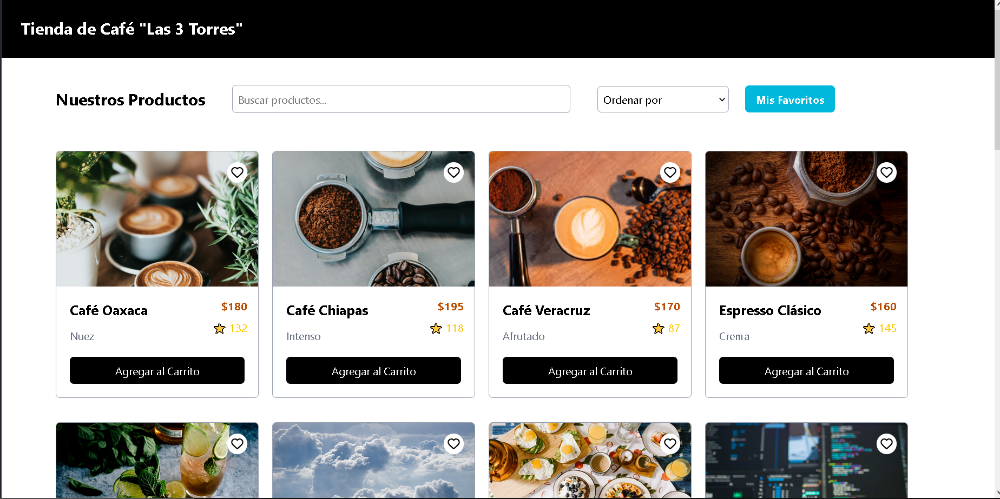
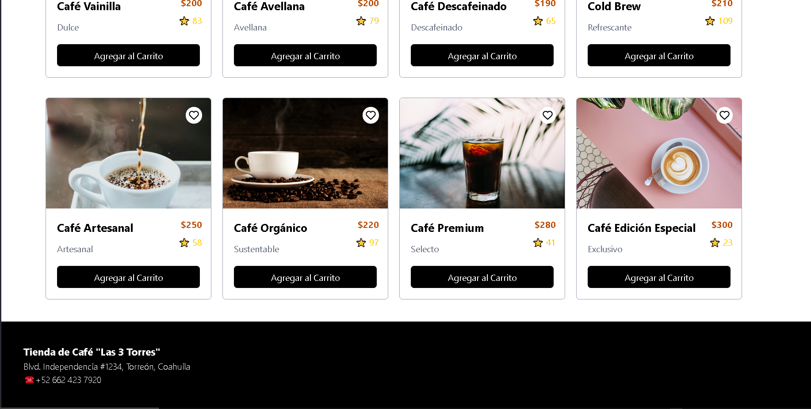

<div align="center">

# ☕ Café-Frontend las Tres Torres

### Visita nuestra lista de productos

</div>

---

## 📝 Descripción del proyecto

Página web de una cafetería, renderizado de cards a partir de un objeto hardcodeado, uso de tailwind. Implementación de cuentas, favoritos, uso de localstorage.

---

## 📸 Capturas de pantalla

|              Vista principal              |              Otra vista              |
| :---------------------------------------: | :----------------------------------: |
|  |  |

---

## 🚀 Instalación y ejecución

### 1. Clona el repositorio

```bash
git clone https://github.com/kacto1973/cafe-frontend
```

### 2. Instala NODE JS en caso de que no lo tengas instalado

https://nodejs.org/es

### 3. Ejecuta el siguiente comando en la carpeta raíz del proyecto

```bash
npm install
```

### 4. Corre el siguiente comando

```bash
npm run dev
```

¡Listo! La aplicación estará corriendo en tu http://localhost:XXXX. 🎉

---

## 🌐 Demo en vivo

**👉 [tres-torres.netlify.app](https://tres-torres.netlify.app/)**
